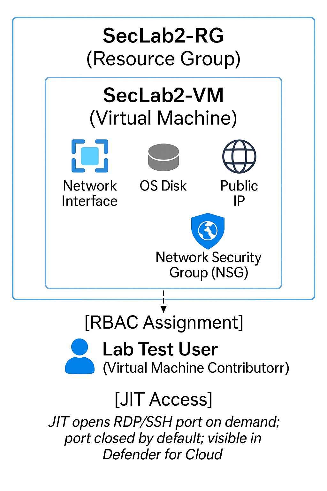

## Azure RBAC & Just-In-Time (JIT) VM Access Lab

Implementation of least-privilege access and privilege management in Microsoft Azure by enforcing Role-Based Access Control (RBAC) for Virtual Machines and enabling Just-In-Time (JIT) access with Microsoft Defender for Servers. Demonstrates real-world privilege reduction, RBAC best practices, and modern attack surface minimization in cloud environments.

---

## Table of Contents

- [Overview]
- [Diagram]
- [Objectives]
- [Steps Performed]
  - [1. User and Group Creation]
  - [2. RBAC Role Assignment]
  - [3. Permission Verification]
  - [4. Defender for Servers / JIT Access]
- [Screenshots]
- [Lessons Learned]
- [References]

---

## Overview

This lab demonstrates how to apply least-privilege principles to Azure infrastructure using RBAC and (if available) Just-In-Time (JIT) VM access. RBAC is used to assign minimal, task-specific permissions to users. JIT, part of Defender for Servers, restricts VM management port exposure to narrow time windows, minimizing the attack surface. These controls align with Zero Trust, real-world privilege management, and compliance standards.

---

## Diagram

---

## Objectives

- Deploy and organize Azure resources securely within a resource group.
- Assign RBAC roles for granular, least-privilege VM access.
- Verify that limited permissions are enforced in practice.
- Clean up all lab resources to avoid charges and demonstrate responsible lifecycle management.

---

## Steps Performed

1. Resource and VM Creation
   - Created resource group: SecLab2-RG in East US.
   - Deployed a Windows Server 2022 VM: SecLab2-VM (size: B1s).
   - Verified creation and resource organization.

2. RBAC Role Assignment
   - Created Azure AD test user: labtestuser@azurelabstest.onmicrosoft.com.
   - Assigned the “Virtual Machine Contributor” role to the test user at the resource group scope using Access Control (IAM).
   - Confirmed the user’s role assignment via the portal.

3. Permission Verification
   - Confirmed the test user could only start/stop/restart the VM and could not delete the resource group or manage roles.
   -Verified effective permissions using the Access Control (IAM) “Role assignments” and “Check access” features.
   - (Direct login as test user not possible due to Azure subscription limits; permissions documented via admin screenshots.)

4. Defender for Servers / JIT Access
   - Enabled Microsoft Defender for Servers on the subscription to allow JIT features (*Note: Just-In-Time VM Access could not be enabled in this environment due to Azure portal limitations for this subscription. In a standard enterprise subscription, the process would continue by enabling JIT on the VM via Defender for Cloud, as documented here.)
   - Demonstrated understanding and documented steps for JIT access control, including screenshot of Defender for Servers activation.

---

## Screenshots

*All screenshots are included in the screenshots/ folder.

| Step | Filename                                                  | Description                                                    |
| ---- | --------------------------------------------------------- | -------------------------------------------------------------- |
| 1    | ResourceGroup-Create-SecLab2-RG.png                       | Resource group `SecLab2-RG` creation/overview                  |
| 2    | VM-Overview-SecLab2-VM.png                                | Virtual machine `SecLab2-VM` overview (name, state, public IP) |
| 3    | RBAC-AddRoleAssignment-VirtualMachineContributor.png      | “Add role assignment” form for Virtual Machine Contributor     |
| 4    | RBAC-RoleAssignments-VM-or-RG.png                         | Role assignments tab showing assigned users/roles              |
| 5    | RBAC-LabTestUser-VirtualMachineContributor-SecLab2-RG.png | Specific RBAC assignment for Lab Test User on RG               |
| 6    | DefenderForServers-Enabled-AfterSave.png                  | Defender for Servers plan enabled in subscription              |

## Screenshot Explanations

1. ResourceGroup-Create-SecLab2-RG.png: Shows the Azure resource group created for the lab and its contents.

2. VM-Overview-SecLab2-VM.png: Displays the details and status of the virtual machine, confirming deployment.

3. RBAC-AddRoleAssignment-VirtualMachineContributor.png: Captures the process of assigning the Virtual Machine Contributor role via IAM.

4. RBAC-RoleAssignments-VM-or-RG.png: Proves which users/roles are assigned at the VM or resource group scope.

5. RBAC-LabTestUser-VirtualMachineContributor-SecLab2-RG.png: Confirms the test user is assigned least-privilege access (VM Contributor role) at the resource group level.

6. DefenderForServers-Enabled-AfterSave.png: Documents that Defender for Servers was enabled to support advanced security controls (like JIT).

---

## Lessons Learned

- RBAC in Azure allows precise, least-privilege access assignment—essential for security and compliance.
- Real-world cloud security involves not only granting but also proving permissions are minimal.
- JIT access further limits the attack surface by reducing standing administrative privilege, though not always available in every subscription.
- Responsible lifecycle management (including cleanup and cost control) is crucial for effective cloud security operations.
- Documenting limitations and linking to official guidance is a valuable, professional practice.

---

## References

- Azure role-based access control (RBAC)
(https://learn.microsoft.com/en-us/azure/role-based-access-control/overview)

- Just-In-Time VM Access in Defender for Cloud
(https://learn.microsoft.com/en-us/azure/defender-for-cloud/just-in-time-access-usage)

- Microsoft Defender for Servers
(https://learn.microsoft.com/en-us/azure/defender-for-cloud/plan-defender-for-servers)

- Resource groups in Azure
(https://learn.microsoft.com/en-us/azure/azure-resource-manager/management/manage-resource-groups-portal)

- Zero Trust Guidance: Zero Trust Security Principles
(https://www.microsoft.com/en-us/security/business/zero-trust)

---

Sebastian Silva C. – July, 2025 – Berlin, Germany.
